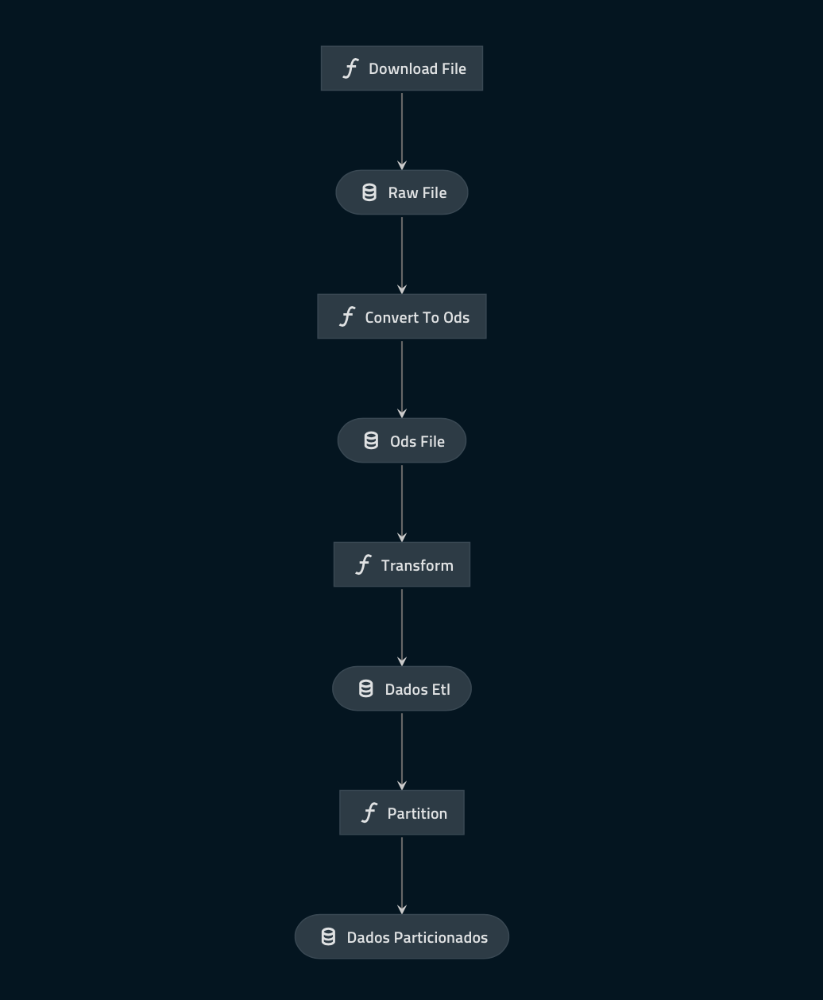

# kedro_etl

  

## Overview

  

Esse é um projeto desenvolvido com [Kedro](https://kedro.readthedocs.io).

  

O projeto realiza o download de um arquivo em `xls` converte para `ods` e em seguida faz a formatação e limpeza dos dados, por fim salva o resultado particionado no diretorio `data/03_primary/etl_raizen`.

  

## Instanciando o projeto com kedro

  

Para criar o ambiente de kedro com o [conda](https://docs.conda.io/en/latest/) utilize os seguintes comandos:

-- `conda create -n kedro-etl-env -y`

-- `conda activate kedro-etl-env`

-- `conda install -c conda-forge kedro -y`

-- `pip install kedro-docker`

  

Para construir a imagem docker executar o seguinte comando:

--`kedro docker build`

  

Após a imagem construida execute a tarefa de etl com o seguinte comando:

--`kedro docker run`

  

#### Validando

Utilize o comando `kedro docker jupyter lab` para iniciar um jupyter lab.

Acessando o notebook `notebooks/validacao.ipynb` existe um dataframe onde o resultado do etl foi carregado e pode ser validado.

  

Utilize o comando `kedro docker cmd --docker-args="-p=4141:4141" kedro viz --host=0.0.0.0` para validar o dataflow resultante.